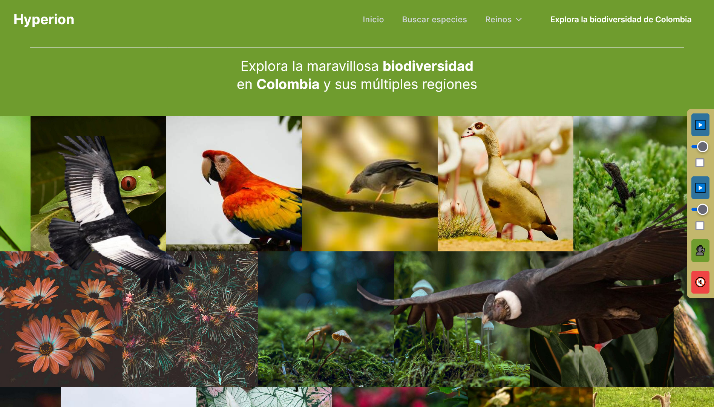

# Hyperion | Datathon del Pacífico 2024

Este proyecto es una aplicación web construida con Astro y un backend en FastAPI. Incluye funcionalidades de búsqueda y utiliza la API de Azure OpenAI.



## 🎥 Presentación del Proyecto

Aquí puedes ver la transmisión de nuestra presentación en el Datathon del Pacífico 2024:

[](https://youtu.be/3Z6SP9oEkMU?t=4335)

Ejemplo del buscador Semántico:

[](https://youtu.be/1WBkRgWvlCg)

## 🛠 Configuración

### Variables de Entorno

Para el frontend (Astro):

```
PUBLIC_API_URL=
PUBLIC_LOCAL_URL=http://localhost:8000/search
```

Para el backend (FastAPI):

```
AZURE_OPENAI_API_KEY=
AZURE_OPENAI_ENDPOINT=
```

## 📦 Instalación

1. Clona este repositorio
2. Instala las dependencias del frontend:
   ```
   npm install
   ```
3. Instala las dependencias del backend:
   ```
   cd backend
   pip install -r requirements.txt
   ```

## 🚀 Comandos

| Comando             | Acción                                               |
| :------------------ | :--------------------------------------------------- |
| `npm install`       | Instala las dependencias                             |
| `npm run dev`       | Inicia el servidor de desarrollo en `localhost:4321` |
| `npm run build`     | Construye el sitio de producción en `./dist/`        |
| `npm run preview`   | Previsualiza la compilación localmente               |
| `npm run astro ...` | Ejecuta comandos CLI como `astro add`, `astro check` |

## 🔍 API de Búsqueda

El endpoint de búsqueda espera un body con el siguiente formato:

```json
{
  "text": "I'm batman",
  "n": 2
}
```

## 🧠 Backend FastAPI

El backend está construido con FastAPI y se encuentra en la carpeta `backend/`. Asegúrate de configurar las variables de entorno necesarias para la conexión con Azure OpenAI.

## 📄 Licencia

Este proyecto está licenciado bajo la licencia Creative Commons Attribution-NonCommercial 4.0 International (CC BY-NC 4.0).

Esto significa que usted es libre de:

- Compartir — copiar y redistribuir el material en cualquier medio o formato
- Adaptar — remezclar, transformar y construir a partir del material

Bajo los siguientes términos:

- Atribución — Debe dar crédito adecuado, proporcionar un enlace a la licencia e indicar si se han realizado cambios. Puede hacerlo de cualquier manera razonable, pero no de una manera que sugiera que el licenciante lo respalda a usted o su uso.
- NoComercial — No puede utilizar el material para fines comerciales.

Para más detalles, visite: [Creative Commons BY-NC 4.0](https://creativecommons.org/licenses/by-nc/4.0/)
